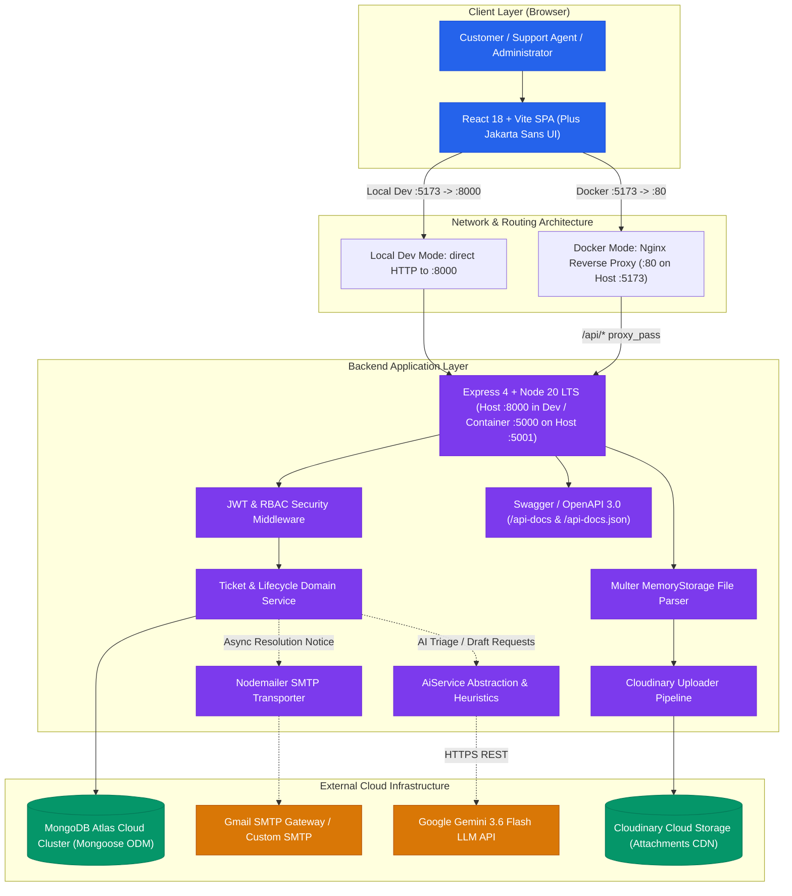
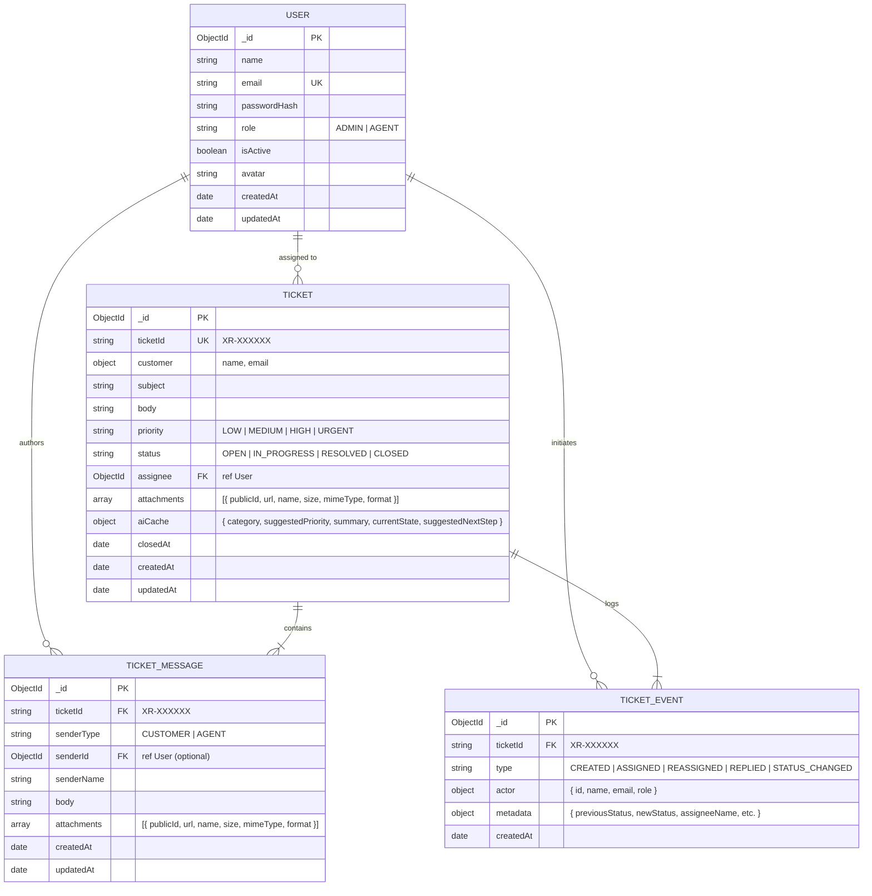
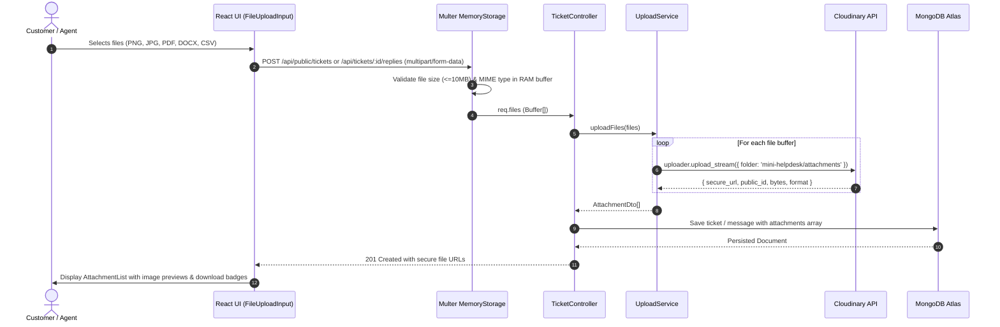
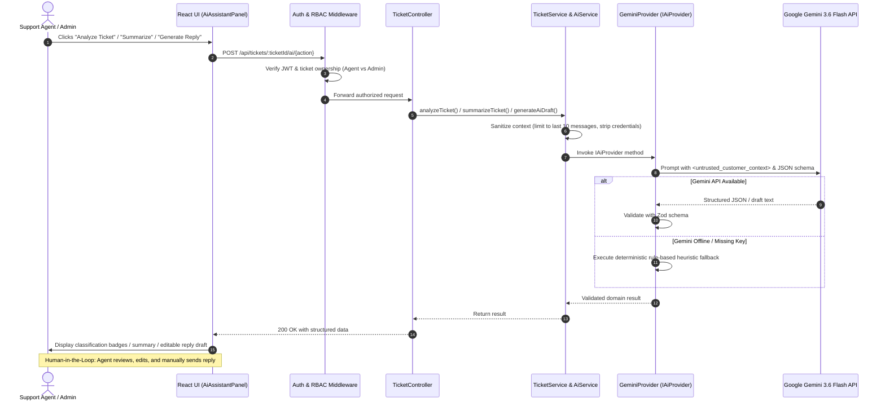

# XRISEAI Mini Helpdesk — Technical Architecture & System Design

This document details the architectural decisions, database schemas, authorization mechanisms, scalability considerations, observability practices, and infrastructure topology for the **XRISEAI Mini Helpdesk** platform.

---

## 1. High-Level System Architecture



---

## 2. Port Architecture & Environment Separation

The application strictly separates Local Development from Docker Containerization:

```
┌─────────────────────────────────────────────────────────────────────────────┐
│                             LOCAL DEVELOPMENT                               │
│                                                                             │
│   Frontend Client            Backend Server          Swagger Docs           │
│   http://localhost:5173  ──► http://localhost:8000   http://localhost:8000  │
│                                (PORT=8000)                 /api-docs        │
└─────────────────────────────────────────────────────────────────────────────┘

┌─────────────────────────────────────────────────────────────────────────────┐
│                            DOCKER CONTAINERIZATION                          │
│                                                                             │
│   Browser Client             Nginx Container         Backend Container      │
│   http://localhost:5173  ──► (Port 80 on Host)   ──► (Port 5000 internal)   │
│                                Proxy /api/* ──►      Host port: 5001        │
│                                                      Swagger: :5001/api-docs│
└─────────────────────────────────────────────────────────────────────────────┘
```

---

## 3. Request Flow Lifecycle

Every incoming HTTP request follows a deterministic, unidirectional pipeline:

```
Request
  │
  ▼
[Security & Tracing Middleware]
  ├── Helmet Security Headers
  ├── CORS Validation
  ├── Pino Request Logger (with correlation x-request-id)
  └── Express Rate Limiter
  │
  ▼
[Parsing & Upload Middleware]
  ├── express.json({ limit: '1mb' })
  ├── cookieParser()
  └── Multer upload.array('attachments', 5) [if multipart/form-data]
  │
  ▼
[Authentication & RBAC Middleware]
  ├── authenticate (Extracts JWT from HttpOnly cookie or Bearer header)
  └── authorize('ADMIN') [for restricted routes]
  │
  ▼
[Validation Layer]
  └── validate({ body, query, params }) with Zod Schemas
  │
  ▼
[Controller Layer] (Thin, parses request DTO, calls domain services)
  │
  ▼
[Domain Services Layer]
  ├── TicketService / AuthService / UserService
  ├── UploadService (streams buffers to Cloudinary)
  ├── EmailService (asynchronous SMTP dispatches)
  └── AiService (Gemini API with fallback heuristics)
  │
  ▼
[Persistence Layer]
  └── Mongoose Models (with Compound Indexes and Connection Pooling)
  │
  ▼
[Response Transformation Layer]
  └── ApiResponse.success / ApiResponse.paginated (Consistent Envelope)
```

---

## 4. Data Models & Database Design



### Schema Decisions & Tradeoff Justification

1. **Dedicated Collections vs. Embedded Arrays**:
   - Rather than storing `messages: []` and `events: []` inside the `Ticket` document, we maintain separate `TicketMessage` and `TicketEvent` collections.
   - **Prevents Document Bloat**: Guarantees the 16MB MongoDB document boundary is never exceeded.
   - **Immutable Compliance Audit Trail**: Events are append-only.
   - **Independent Pagination**: Allows fast retrieval of conversation history.
2. **Lightweight Embedded `aiCache`**:
   - Persisted on `Ticket` to eliminate multi-collection `$lookup` joins when loading ticket details.
   - Atomically invalidated (`$set: { 'aiCache.summary': null }`) whenever a new reply is created.
3. **Compound Indexes**:
   - `{ assignee: 1, status: 1, createdAt: -1 }`: Optimizes agent dashboard queries.
   - `{ ticketId: 1 }`: Unique B-tree index for O(1) telemetry lookups.
   - `{ 'customer.email': 1 }`: Accelerated public ticket verification.
   - Text index on `{ subject: 10, body: 5 }`: Fast full-text search.

---

## 5. File Upload & Cloudinary Storage Pipeline



---

## 6. Authentication, Security & RBAC Scoping

### 1. Token Architecture
- **JWT Signing**: HMAC-SHA256 signature using a minimum 32-character secret (`JWT_SECRET`).
- **Cookie Transport**: `HttpOnly`, `SameSite=None` (or `Lax`), `Secure` cookie preventing cross-site scripting (XSS) extraction.
- **Authorization Header**: Supports `Authorization: Bearer <token>` for API clients and Swagger UI.

### 2. Database-Level Query Scoping
Security is enforced at the database query level rather than relying on frontend route guards:

```ts
// Enforced inside TicketService.getTickets():
const filter: FilterQuery<ITicketDocument> = {};

if (user.role === 'AGENT') {
  // Agent query automatically constrained to their assigned user ID
  filter.assignee = user._id;
}
// ADMIN role can query all tickets or specify an optional assignee filter
```

---

## 7. Google Gemini AI Enhancement Layer



### Safety & Privacy Guarantees:
- **Zero Core Dependency**: Core ticket submission and resolution never depend on AI availability.
- **Prompt Injection Defense**: Untrusted customer inputs are wrapped in strict delimiters (`<untrusted_customer_context>`).
- **Human-in-the-Loop**: Drafts are populated into an editable composer; AI never sends messages autonomously.

---

## 8. Scalability & Concurrency Strategy

1. **Horizontal API Scaling**: Stateless Express containers behind Nginx load balancing.
2. **Database Concurrency**: Atomic `findOneAndUpdate` operations prevent race conditions during ticket reassignment or status transitions.
3. **Connection Pooling**: Mongoose connection pool (`maxPoolSize: 50`) optimized for high-throughput container clusters.
4. **Cloud Media Offload**: Multer memory buffers stream directly to Cloudinary CDN, bypassing local disk I/O bottlenecks.

---

## 9. Observability & Telemetry

- **Structured JSON Logging**: Pino logger outputs structured logs with correlation IDs (`x-request-id`).
- **Secret Redaction**: Passwords, authorization tokens, cookies, and database credentials are automatically redacted from logs.
- **Health Telemetry**: `/api/health` exposes real-time uptime, service status, and MongoDB Atlas connectivity state.
