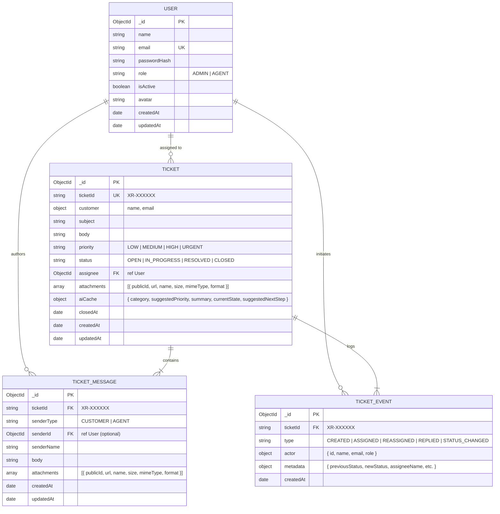

# 🚀 XRISEAI Mini Helpdesk

A modern, production-grade SaaS customer support and ticketing platform built with **React 18, TypeScript, Tailwind CSS, Node.js, Express, MongoDB Atlas, JWT Authentication, Cloudinary file attachments, Nodemailer SMTP service, Google Gemini AI triage**, and **Docker containerization**.


---

## 📋 Table of Contents

- [Overview](#-overview)
- [System Architecture](#-system-architecture)
- [Key Features](#-key-features)
  - [1. Core Helpdesk & Ticket Lifecycle](#1-core-helpdesk--ticket-lifecycle)
  - [2. Authentication, Security & RBAC](#2-authentication-security--rbac)
  - [3. Cloudinary & Multer File Attachments](#3-cloudinary--multer-file-attachments)
  - [4. Google Gemini AI Assistant Layer](#4-google-gemini-ai-assistant-layer)
  - [5. Nodemailer Transactional Email Service](#5-nodemailer-transactional-email-service)
  - [6. Interactive Swagger / OpenAPI Documentation](#6-interactive-swagger--openapi-documentation)
- [Port Architecture & Network Mapping](#-port-architecture--network-mapping)
- [Project Structure](#-project-structure)
- [Database Schema & Models](#-database-schema--models)
- [Local Development Setup](#-local-development-setup)
- [Docker Setup & Deployment](#-docker-deployment)
- [Environment Variables (.env.example)](#-environment-variables-envexample)
- [API Reference](#-api-reference)
- [Automated Testing](#-automated-testing)
- [License](#-license)

---

## 🔭 Overview

The **XRISEAI Mini Helpdesk** is an enterprise-ready customer support platform engineered to provide:
1. **Public Customer Portal**: Instant ticket submission with multipart file attachments, real-time telemetry tracking, and verification-gated status lookups without requiring customer registration.
2. **Staff Workspace**: Role-Based Access Control (RBAC) separating Support Agents (scoped to assigned tickets) and Administrators (global queue oversight, manual and round-robin agent reassignment, and staff roster management).
3. **AI Enhancement Layer**: Google Gemini AI triage engine that performs multi-class intent categorization, customer sentiment scoring, 5-point conversation summarization, and context-aware draft reply generation (with strict human-in-the-loop safeguards).
4. **Cloud Infrastructure**: Cloudinary media pipeline via Multer memory streaming, Gmail SMTP transactional emails for ticket resolution, and live MongoDB Atlas clustering.

---

## 🏛️ System Architecture

```
                                  BROWSER CLIENT
                         (React 18 + Vite + Tailwind CSS)
                                        │
                    ┌───────────────────┴───────────────────┐
                    │                                       │
            [Local Development]                     [Docker Container]
            http://localhost:5173                   http://localhost:5173
                    │                                       │
                    │ (Direct HTTP)                         ▼ (Nginx Reverse Proxy)
                    │                                Nginx Container (:80)
                    │                                       │
                    ▼                                       ▼ (/api/* proxy)
            Express Backend API                     Express Backend Container
           http://localhost:8000                     http://backend:5000 (Host :5001)
                    │                                       │
                    └───────────────────┬───────────────────┘
                                        │
               ┌────────────────────────┼────────────────────────┐
               ▼                        ▼                        ▼
     MongoDB Atlas Cluster       Cloudinary Media          Google Gemini AI
    (Mongoose ODM + Pooling)   (Multer Stream Storage)   (AI Triage & Summaries)
               │
               ▼
       Nodemailer SMTP
     (Resolution Emails)
```

---

## 🌟 Key Features

### 1. Core Helpdesk & Ticket Lifecycle
- **Public Ticket Submission (`/submit-ticket`)**: Customers can log support inquiries with subject, description, priority, and optional file attachments (images, PDFs, documents).
- **Public Status Tracking (`/check-status`)**: Security-gated status tracking requiring both `ticketId` and `email` to inspect lifecycle states (`OPEN`, `IN_PROGRESS`, `RESOLVED`, `CLOSED`), relative timestamps, and verified staff replies without exposing internal agent notes.
- **Dynamic Progress Tracker**: Interactive `TicketProgressTracker` component that visualizes the current ticket lifecycle stage (`Submitted` → `Under Review` → `Investigation` → `Resolved`).
- **Staff Ticket Workspace (`/agent/tickets`)**: Comprehensive dashboard for support staff with instant search, status filtering, category detection, and customer avatars.
- **Detailed Ticket Timeline (`/agent/tickets/:ticketId`)**: Chronological unified view of all customer-agent messages, cloud file attachments, and immutable audit events (`CREATED`, `ASSIGNED`, `REASSIGNED`, `REPLIED`, `STATUS_CHANGED`).
- **Status & Priority Controls**: One-click lifecycle state transitions and priority elevation (`LOW`, `MEDIUM`, `HIGH`, `URGENT`).
- **Ticket Reassignment (Admin)**: Dedicated modal allowing administrators to reassign tickets to specific agents or trigger **Round-Robin Auto-Assignment**.
- **Dashboard Telemetry (`/agent/dashboard`)**: Metric cards calculating open count, in-progress count, average response time, and team pulse (CSAT satisfaction rating).

---

### 2. Authentication, Security & RBAC
- **Stateless JWT Tokens**: Signed tokens containing user claims (`sub`, `email`, `role`, `name`) with customizable expiration (`7d`).
- **HttpOnly Cookie & Bearer Fallback**: Tokens are transported securely via `HttpOnly`, `SameSite`, `Secure` cookies with automatic `Authorization: Bearer <token>` fallback for API clients and Swagger.
- **Role-Based Access Control (RBAC)**:
  - **AGENT**: Scoped exclusively to assigned tickets (`{ assignee: user._id }`). Attempting to view or modify unassigned tickets triggers an immediate `403 Forbidden`.
  - **ADMIN**: Global oversight to query all tickets, access the staff roster (`GET /api/agents`), and reassign tickets.
- **Input Validation**: Strict Zod schemas validating all request bodies, query parameters, and route parameters.
- **Rate Limiting**: Multi-tiered protection via `express-rate-limit`:
  - Global API: 100 requests / 15 min
  - Auth (Login): 15 attempts / 15 min
  - Public Ticket Submission: 10 submissions / 15 min
  - Public Status Checks: 30 lookups / 15 min
- **Security Headers & CORS**: Strict Helmet policies and origin-restricted CORS preventing unauthorized cross-origin requests.

---

### 3. Cloudinary & Multer File Attachments

The application features an end-to-end cloud storage pipeline for ticket attachments:

```
[Client File Selection]
       │ (multipart/form-data: up to 5 files, max 10MB each)
       ▼
[Backend Multer Middleware]
       │ (MemoryStorage buffer validation for JPEG, PNG, WEBP, PDF, TXT, CSV, DOCX)
       ▼
[Upload Service]
       │ (cloudinary.uploader.upload_stream into 'mini-helpdesk/attachments')
       ▼
[Cloudinary CDN]
       │ (Generates secure HTTPS URL & unique publicId)
       ▼
[MongoDB Atlas Database]
       │ (Persists Attachment subdocument: { publicId, url, name, size, mimeType, format })
       ▼
[Client Interface]
       │ (Renders interactive AttachmentList with image preview, icon badges, and download links)
```

- **Supported Formats**: Images (`image/jpeg`, `image/png`, `image/webp`), Documents (`application/pdf`, `text/plain`, `text/csv`, `application/vnd.openxmlformats-officedocument.wordprocessingml.document`).
- **Credential Protection**: Cloudinary credentials (`CLOUDINARY_CLOUD_NAME`, `CLOUDINARY_API_KEY`, `CLOUDINARY_API_SECRET`) are read exclusively from environment variables with zero hardcoding in source files.

---

### 4. Google Gemini AI Assistant Layer

The AI Support Assistant provides real-time productivity tooling for agents:

1. **Smart Ticket Classification (`POST /api/tickets/:ticketId/ai/analyze`)**:
   - Categorizes tickets into `Technical`, `Billing`, `Account`, `Security`, `Feature Request`, or `General`.
   - Computes customer sentiment (`POSITIVE`, `NEUTRAL`, `NEGATIVE`) with sentiment confidence scores.
   - Recommends appropriate priority with a 1-click `"Apply →"` trigger.
2. **Ticket Summarization (`POST /api/tickets/:ticketId/ai/summarize`)**:
   - Distills long multi-turn ticket threads into a structured 4-part summary: *Customer's Main Problem*, *Important Context*, *Current State*, and *Suggested Next Step*.
3. **AI Reply Drafting (`POST /api/tickets/:ticketId/ai/draft`)**:
   - Generates an empathetic, context-aware draft reply addressing the customer's exact inquiry.
4. **Human-in-the-Loop Safeguards**:
   - The AI **never** automatically dispatches emails or modifies ticket statuses on its own.
   - Drafts are populated into an editable composer for the agent to review, personalize, and manually send.
5. **Deterministic Offline Fallbacks**:
   - If the Gemini API key is missing or unavailable, the system transparently falls back to deterministic rule-based heuristic analyzers so zero core helpdesk functionality is disrupted.

---

### 5. Nodemailer Transactional Email Service

- **SMTP Transporter**: Configured using standard SMTP credentials or Gmail App Passwords via environment variables (`SMTP_HOST`, `SMTP_PORT`, `SMTP_USER`, `SMTP_PASS`, `SMTP_FROM`).
- **Automated Lifecycle Notifications**:
  - **Ticket Intake**: Dispatches an immediate confirmation email to the customer containing their unique tracking ID and a direct status lookup link.
  - **Ticket Resolution**: Sends a formatted resolution notification to the customer when an agent marks a ticket as `RESOLVED`.
- **Non-Blocking Execution**: Email dispatches are executed asynchronously, ensuring API responses remain fast and resilient even if SMTP servers experience latency.

---

### 6. Interactive Swagger / OpenAPI Documentation

Swagger UI and OpenAPI 3.0 specifications are available across both local development and Docker:

- **Local Development**:
  - UI: [http://localhost:8000/api-docs](http://localhost:8000/api-docs)
  - OpenAPI JSON: [http://localhost:8000/api-docs.json](http://localhost:8000/api-docs.json)
  - Server URL: `http://localhost:8000`
- **Docker Environment**:
  - UI: [http://localhost:5001/api-docs](http://localhost:5001/api-docs)
  - OpenAPI JSON: [http://localhost:5001/api-docs.json](http://localhost:5001/api-docs.json)
  - Server URL: `http://localhost:5001`

**Features**:
- 16 fully documented real endpoints across 6 functional tags (`Health`, `Auth`, `Public Tickets`, `Tickets`, `Agents`, `AI Assistant`).
- Request and response schemas for all operations, including multipart file uploads.
- Single `BearerAuth` (HTTP Bearer JWT) authentication scheme for protected routes.

---

## 🔌 Port Architecture & Network Mapping

| Environment | Frontend URL | Backend Host URL | Internal Container Port | Swagger UI |
|---|---|---|---|---|
| **Local Development** | `http://localhost:5173` | `http://localhost:8000` | N/A | `http://localhost:8000/api-docs` |
| **Docker** | `http://localhost:5173` (Nginx :80) | `http://localhost:5001` | `5000` (`5001:5000`) | `http://localhost:5001/api-docs` |

### Docker Network Flow:
```
Browser Client (localhost:5173)
       │
       ▼
Nginx Container (:80)
       ├── Static SPA Assets (HTML, CSS, JS)
       └── /api/*  ──proxy_pass──►  Backend Container (:5000)
                                           │
                                           ▼
                                    MongoDB Atlas / Cloudinary / Gemini / SMTP
```

---

## 📁 Project Structure

```
mini-helpdesk/
├── backend/                              # Node.js + Express + TypeScript
│   ├── src/
│   │   ├── config/                       # env.ts (Zod validation), cloudinary.ts, logger.ts, swagger.ts
│   │   ├── controllers/                  # auth, health, ticket, user controllers
│   │   ├── db/                           # connection.ts, seed.ts (idempotent seeder)
│   │   ├── middleware/                   # auth, authorize, errorHandler, notFound, rateLimiter, upload (Multer), validate
│   │   ├── models/                       # ticket, ticketMessage, ticketEvent, user (Mongoose schemas)
│   │   ├── modules/                      # ai (AiService, GeminiProvider, heuristics)
│   │   ├── repositories/                 # ticket.repository.ts
│   │   ├── routes/                       # auth, health, ticket, user, index.ts
│   │   ├── schemas/                      # auth, ticket (Zod request schemas)
│   │   ├── services/                     # auth, email, ticket, upload, user services
│   │   ├── types/                        # auth, ticket, user, upload TypeScript interfaces
│   │   ├── utils/                        # apiError, apiResponse, asyncHandler, jwt, ticketId
│   │   ├── views/                        # ticket.view.ts, user.view.ts (DTO transformers)
│   │   ├── app.ts                        # Express application setup & middleware stack
│   │   └── server.ts                     # Server entry point & graceful shutdown
│   ├── tests/                            # Vitest integration test suites (auth, tickets, ai, health)
│   ├── Dockerfile                        # Multi-stage production backend Dockerfile
│   ├── package.json                      # Backend dependencies and scripts
│   └── tsconfig.json                     # Strict TypeScript configuration
│
├── frontend/                             # React 18 + Vite + Tailwind CSS + TypeScript
│   ├── src/
│   │   ├── components/
│   │   │   ├── common/                   # LoadingSkeleton, ErrorState, ScrollReveal, ScrollStagger
│   │   │   ├── layout/                   # PublicLayout (Navbar & Footer), AgentLayout (Sidebar & Header)
│   │   │   └── ui/                       # Button, Input, Textarea, Select, FileUploadInput, AttachmentList
│   │   ├── features/
│   │   │   ├── agents/                   # agentApi, useAgents hook, agent types
│   │   │   ├── auth/                     # authApi, authStore (Zustand), ProtectedRoute, login schemas
│   │   │   ├── dashboard/                # MetricStatCard, TeamPulseCard, DashboardHeader, MetricsGrid
│   │   │   ├── public-portal/            # PublicComponents, EvaluationAccess, public hooks & APIs
│   │   │   └── tickets/                  # TicketCard, TicketTimeline, TicketReplyBox, TicketProgressTracker,
│   │   │                                 # CreateTicketModal, ReassignTicketModal, AiAssistantPanel, badges
│   │   ├── lib/                          # apiClient (Axios instance), utils (formatters)
│   │   ├── pages/
│   │   │   ├── agent/                    # DashboardPage, TicketListPage, TicketDetailPage
│   │   │   └── public/                   # LandingPage, SubmitTicketPage, CheckStatusPage, GetInTouchPage, LoginPage
│   │   ├── routes/                       # AppRoutes.tsx
│   │   ├── store/                        # useUiStore (Zustand reply drafts & active filters)
│   │   ├── App.tsx                       # Root application component with QueryClient
│   │   ├── index.css                     # Design system tokens, Plus Jakarta Sans, glassmorphism utilities
│   │   └── main.tsx                      # Vite React root
│   ├── Dockerfile                        # Multi-stage production frontend Dockerfile (Nginx)
│   ├── nginx.conf                        # Nginx SPA routing and /api reverse-proxy configuration
│   ├── package.json                      # Frontend dependencies and scripts
│   └── vite.config.ts                    # Vite bundler configuration & local dev proxy
│
├── .dockerignore                         # Docker build exclusion rules
├── .env.example                          # Safe environment variable documentation template
├── ARCHITECTURE.md                       # Comprehensive system architecture & design tradeoffs
├── CREDENTIALS.md                        # Pre-seeded test credentials and verification guides
├── docker-compose.yml                    # Multi-container orchestration specification
└── package.json                          # Workspace root package configuration
```

---

## 🗄️ Database Schema & Models



---

## 💻 Local Development Setup

### 1. Prerequisites
- **Node.js**: v20.x or higher
- **npm**: v10.x or higher
- **MongoDB Atlas**: Free cluster M0 or connection string

### 2. Installation
```bash
# Clone repository
git clone <repository-url>
cd mini-helpdesk

# Install workspace dependencies
npm install
```

### 3. Environment Setup
Create a single root `.env` file based on `.env.example`:
```bash
cp .env.example .env
```

Fill in your connection details (see [Environment Variables](#-environment-variables-envexample)).

### 4. Database Seeding
Populate the database with administrator accounts, demo agents, and sample tickets:
```bash
npm run seed --workspace=backend
```

### 5. Start Development Servers
```bash
# Run both frontend and backend concurrently
npm run dev
```

- **Frontend Portal**: [http://localhost:5173](http://localhost:5173)
- **Backend API**: [http://localhost:8000](http://localhost:8000)
- **Swagger Documentation**: [http://localhost:8000/api-docs](http://localhost:8000/api-docs)

---

## 🐳 Docker Deployment

To run the complete application inside Docker containers (connecting to your cloud MongoDB Atlas cluster and Cloudinary):

### 1. Build and Launch Containers
```bash
# Start containers in detached mode with build
docker compose up -d --build
```

### 2. Verify Container Health
```bash
docker compose ps
```
**Expected Output:**
```
NAME                     IMAGE                    COMMAND                  SERVICE    STATUS   PORTS
mini-helpdesk-backend    mini-helpdesk-backend    "docker-entrypoint.s…"   backend    Up       0.0.0.0:5001->5000/tcp
mini-helpdesk-frontend   mini-helpdesk-frontend   "/docker-entrypoint.…"   frontend   Up       0.0.0.0:5173->80/tcp
```

### 3. Access Docker Services
- **Web Application**: [http://localhost:5173](http://localhost:5173)
- **Backend API**: [http://localhost:5001](http://localhost:5001)
- **Swagger Documentation (Docker)**: [http://localhost:5001/api-docs](http://localhost:5001/api-docs)

### Common Docker Operations:
```bash
# View backend logs in real-time
docker compose logs -f backend

# Stop containers without removing
docker compose stop

# Restart containers
docker compose restart

# Stop and remove containers and network
docker compose down
```

---

## 🔐 Environment Variables (`.env.example`)

```ini
# ==============================================================================
# XRISEAI MINI HELPDESK — ENVIRONMENT CONFIGURATION TEMPLATE
# ==============================================================================

# Server Configuration
NODE_ENV=development
PORT=8000
API_BASE_URL=http://localhost:8000

# Client Configuration (CORS & Auth Cookie Domain)
CLIENT_URL=http://localhost:5173
VITE_API_URL=http://localhost:8000

# Database Connection (MongoDB Atlas Cloud Cluster SRV Format)
MONGODB_URI=mongodb+srv://<username>:<password>@<cluster-name>.mongodb.net/mini_helpdesk?retryWrites=true&w=majority

# Authentication (JWT & Cookie Settings)
JWT_SECRET=your_secure_jwt_secret_minimum_32_characters_long
JWT_EXPIRES_IN=7d
COOKIE_NAME=helpdesk_auth_token

# Google Gemini AI (Optional - heuristic fallback used if omitted)
GEMINI_API_KEY=your_google_gemini_api_key_here

# Rate Limiting
RATE_LIMIT_WINDOW_MS=900000
RATE_LIMIT_MAX=100

# Nodemailer SMTP Service (Gmail App Password or Custom SMTP)
SMTP_HOST=smtp.gmail.com
SMTP_PORT=587
SMTP_USER=your_email@gmail.com
SMTP_PASS=your_gmail_app_password
SMTP_FROM="XRISEHelpDesk <your_email@gmail.com>"

# Cloudinary (Required for Ticket File Attachments)
CLOUDINARY_CLOUD_NAME=your_cloudinary_cloud_name
CLOUDINARY_API_KEY=your_cloudinary_api_key
CLOUDINARY_API_SECRET=your_cloudinary_api_secret
```

---

## 📡 API Reference

### Health
- `GET /api/health` — Check system telemetry, uptime, and database status.

### Authentication
- `POST /api/auth/login` — Staff sign-in and JWT token issuance.
- `POST /api/auth/logout` — Clear session cookies.
- `GET /api/auth/me` — *(Auth required)* Fetch active user profile.

### Public Tickets (Customer Facing)
- `POST /api/public/tickets` — Submit a new support ticket with optional file attachments (multipart/form-data).
- `POST /api/public/tickets/status` — Look up ticket progress by `ticketId` and `email`.

### Staff Ticket Management (JWT Required)
- `GET /api/tickets` — List tickets with query filters (`status`, `priority`, `search`, `page`, `limit`). Scoped automatically to assigned agent.
- `POST /api/tickets` — Create internal ticket with direct or round-robin agent assignment.
- `GET /api/tickets/:ticketId` — Get full ticket details.
- `GET /api/tickets/:ticketId/timeline` — Retrieve unified conversation messages and audit event logs.
- `POST /api/tickets/:ticketId/replies` — Post staff reply with optional file attachments.
- `PATCH /api/tickets/:ticketId/status` — Update lifecycle status (`OPEN`, `IN_PROGRESS`, `RESOLVED`, `CLOSED`).

### Administration & AI (Protected)
- `PATCH /api/tickets/:ticketId/assignee` — *(Admin only)* Reassign ticket to another agent.
- `GET /api/agents` — *(Admin only)* Fetch staff roster.
- `POST /api/tickets/:ticketId/ai/analyze` — Gemini AI categorization and sentiment triage.
- `POST /api/tickets/:ticketId/ai/summarize` — Gemini AI 4-part conversation summary.
- `POST /api/tickets/:ticketId/ai/draft` — Gemini AI context-aware draft reply generator.

---

## 🧪 Automated Testing

The project includes an end-to-end Vitest test suite validating controllers, services, RBAC query scoping, AI safeguards, and schema validation:

```bash
# Run complete test suite
npm test --workspace=backend

# Run type checks across all workspaces
npm run typecheck --workspace=backend
npm run build --workspace=frontend
```

---

## 🔑 Demo Credentials

| Role | Name | Email | Password | Access Scope |
|---|---|---|---|---|
| **👑 ADMIN** | System Admin | `admin@xriseai.com` | `admin@123` | Global ticket queue, agent reassignments, staff roster, all replies |
| **🛡️ AGENT 1** | Aarav Sharma | `agent1@xriseai.com` | `agent1@123` | Assigned tickets, reply composer, AI assistant, status controls |
| **🛡️ AGENT 2** | Ananya Patel | `agent2@xriseai.com` | `agent2@123` | Assigned tickets, reply composer, AI assistant, status controls |
| **🛡️ AGENT 3** | Rohan Verma | `agent3@xriseai.com` | `agent3@123` | Assigned tickets, reply composer, AI assistant, status controls |

---

## 📄 License
MIT License. Built with ❤️ for the XRISEAI Engineering Platform.
